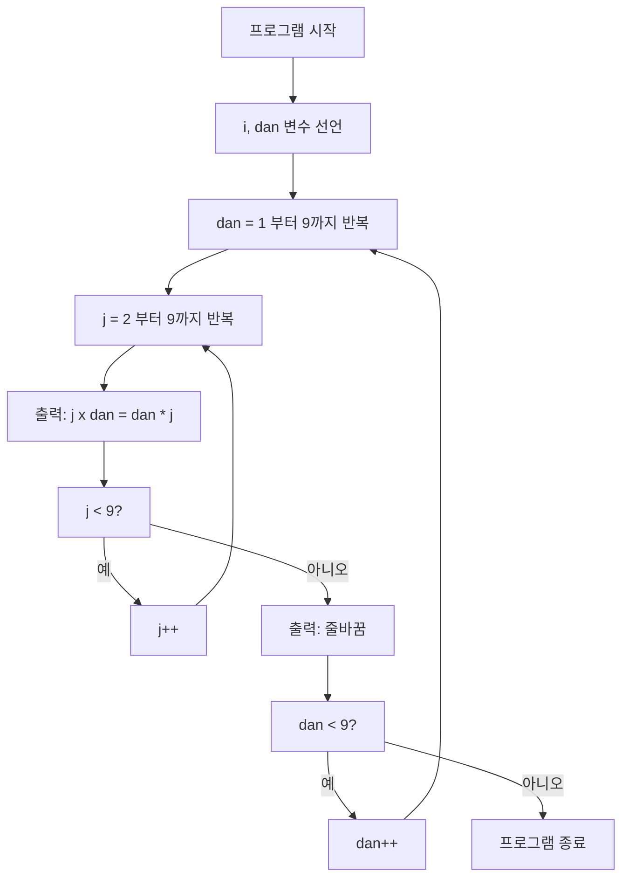

```mermaid
flowchart TD
    Start[프로그램 시작] --> Init[i, dan 변수 선언]
    Init --> OuterLoopStart[dan = 1 부터 9까지 반복]
    OuterLoopStart --> InnerLoopStart[j = 2 부터 9까지 반복]
    InnerLoopStart --> PrintGugudan["출력: j x dan = dan * j"]
    PrintGugudan --> CheckInner[j < 9?]
    CheckInner -- 예 --> InnerIncrement[j++]
    InnerIncrement --> InnerLoopStart
    CheckInner -- 아니오 --> NewLine["출력: 줄바꿈"]
    NewLine --> CheckOuter[dan < 9?]
    CheckOuter -- 예 --> OuterIncrement[dan++]
    OuterIncrement --> OuterLoopStart
    CheckOuter -- 아니오 --> End[프로그램 종료]
```